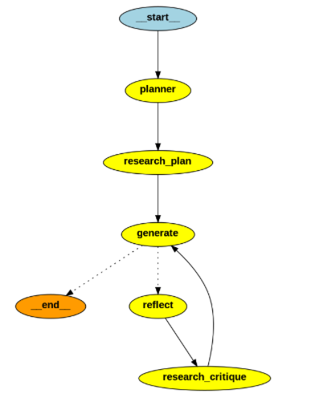

# Research Agent

[](https://www.python.org/)
[](https://opensource.org/licenses/MIT)

A FastAPI-based research agent application that provides RESTful endpoints for managing agents, processing documents, and conducting research tasks. Features include text extraction, tokenization, and OCR capabilities.

## Table of Contents

- [Overview](#overview)
- [Features](#features)
- [Project Structure](#project-structure)
- [Installation](#installation)
- [Running the Application](#running-the-application)
- [API Endpoints](#api-endpoints)
- [Docker Setup](#docker-setup)
- [Contributing](#contributing)
- [License](#license)

## Overview

The Research Agent is a comprehensive API that:
- Processes and analyzes documents and web content
- Manages research agents with associated files and websites
- Implements token-aware content management

### Multi-Agent Workflow

The system uses a LangGraph-based workflow with multiple specialized agents:

1. **Planner Agent**: Creates high-level outlines and plans for research tasks
2. **Research Agent**: 
   - Generates search queries based on the plan
   - Uses Tavily for information gathering
   - Processes and extracts key information
3. **Generation Agent**: Creates content based on research and plan
4. **Reflection Agent**: Reviews and critiques generated content
5. **Research Critique Agent**: Performs targeted research based on critique

The agents work together in a flexible workflow that can:
- Adapt the research path based on initial findings
- Perform multiple revision cycles
- Conduct additional research when needed
- Generate comprehensive and well-researched content


## Features

### Core Functionality
- **Agent Management:** Create, retrieve, and delete research agents
- **Document Processing:** 
  - Extract text from multiple file formats (.pdf, .docx, .doc, .xlsx, .xls, .ppt, .pptx)
  - OCR support for images and scanned documents
  - Token-aware content processing
- **Web Content:** 
  - Website content extraction and processing
  - Token-based content management
- **Research Tasks:** Execute and manage research queries
- **Token Management:** Automatic token counting and limit enforcement (120k tokens)

### Technical Features
- FastAPI backend with async support
- MongoDB database integration
- Docker containerization
- Comprehensive error handling
- Detailed logging system

## Project Structure

```plaintext
research_agent/
│── app/
│   ├── main.py              # FastAPI application entry point
│   
│── agents/
│   ├── agent.py            # Core agent logic
│   ├── file_extractor.py   # File processing and text extraction
│   └── webscrape.py        # Website content extraction
│
│── docker/
│   ├── Dockerfile          # Docker configuration
│   └── requirements.txt    # Python dependencies
│
└── docker-compose.yml      # Docker Compose configuration
```

## Installation

1. Clone the repository:
```bash
git clone https://github.com/yourusername/research-agent.git
cd research_agent
```

2. Install Docker:
```bash
# Backend
docker-compose up --build
(it takes a while to run, please be patient)
```

## API Endpoints

- `POST /agents` - Create new agent
- `GET /agents/{agent_id}` - Retrieve agent details
- `DELETE /agents/{agent_id}` - Delete agent
- `PUT /agents/{agent_id}/files` - Update agent files
- `PUT /agents/{agent_id}/websites` - Update agent websites
- `POST /agents/{agent_id}/queries` - Send research query

## Running the Application

1. Start the backend:
```bash
docker-compose up --build
```

2. Start the frontend:
```bash
cd frontend
npm start
```

## Contributing

Contributions are welcome! Please feel free to submit a Pull Request.

## License

This project is licensed under the MIT License.

---

Feel free to adjust the sections, badges, and links (such as the repository URL) to fit your project's specific details. Enjoy building your Research Agent!


